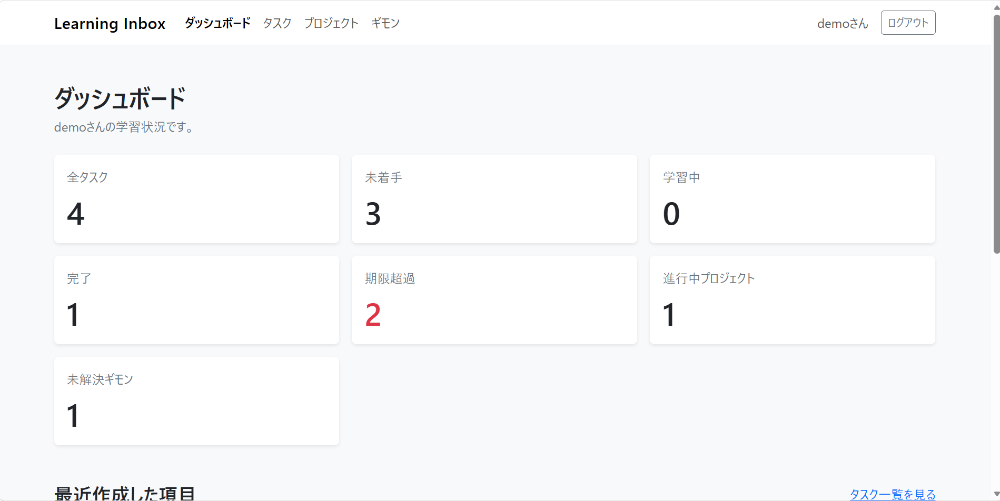
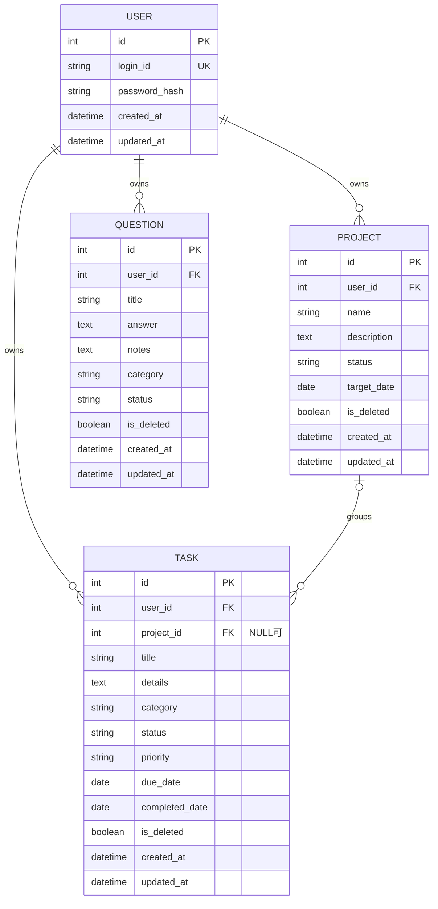

# Learning Inbox

## アプリ概要

Learning Inboxは、学習中の「やること」「長期目標」「疑問と回答」をまとめて管理するWebアプリです。

- タスク：これから行う学習内容
- プロジェクト：資格取得などの長期的な学習目標
- ギモン：学習中に生まれた疑問と、調査して分かった回答

情報を役割ごとに整理し、ダッシュボードで学習状況を振り返ることができます。

## 開発目的

- 学習中または日常で生じた疑問とその答えをまとめておく場所をつくる
- PythonとFlaskを使ったWebアプリ開発の流れを理解する
- AIを使用したアプリケーション開発を体験する

特に、次の内容を意識しています。

- プロンプトによるAIの出力結果のコントロール
- FlaskのアプリケーションファクトリとBlueprintによる機能分割
- SQLAlchemyを使ったデータベース操作
- Flask-Loginによる認証と、所有者確認による認可
- Flask-WTFによる入力検証とCSRF対策
- 論理削除や検索など、実際の業務を意識した処理
- pytestによる重要機能の自動テスト

## 主な機能

- ログイン・ログアウト
- タスクの登録、一覧、詳細、編集、論理削除
- タスクのキーワード検索、絞り込み、並べ替え
- プロジェクトの登録、一覧、詳細、編集、論理削除
- プロジェクト削除時に所属タスクを未所属へ変更
- ギモンの登録、一覧、詳細、編集、論理削除
- ギモンのキーワード検索、状態・カテゴリ絞り込み、並べ替え
- 未解決・解決済みの管理
- ダッシュボードによる件数集計と最近の項目表示
- 404、403、500エラー画面
- デモデータ作成用Flask CLIコマンド

## 使用技術

| 分類 | 技術 |
| --- | --- |
| バックエンド | Python、Flask |
| テンプレート | Jinja2 |
| データベース | SQLite |
| ORM | Flask-SQLAlchemy |
| 認証 | Flask-Login、Werkzeug |
| フォーム | Flask-WTF、WTForms |
| フロントエンド | HTML、Bootstrap、自作CSS、必要最小限のJavaScript |
| テスト | pytest、Flaskテストクライアント |
| バージョン管理 | Git、GitHub |

## 画面イメージ

画面画像は`docs/images/`へ配置します。

掲載予定の画像：

- `docs/images/login.png`：ログイン画面
- `docs/images/dashboard.png`：ダッシュボード
- `docs/images/tasks.png`：タスク一覧
- `docs/images/projects.png`：プロジェクト一覧
- `docs/images/questions.png`：ギモン一覧

画像を追加した後、次のようにREADMEへ掲載できます。

```markdown

```

## セットアップ手順

以下はWindows PowerShellでの手順です。

### 1. リポジトリを取得

```powershell
git clone https://github.com/salarythief27/Learning-Inbox.git
cd Learning-Inbox
```

### 2. 仮想環境を作成

```powershell
python -m venv .venv
```

PowerShellで有効化します。

```powershell
.\.venv\Scripts\Activate.ps1
```

コマンドプロンプトの場合：

```bat
.venv\Scripts\activate.bat
```

### 3. ライブラリをインストール

アプリの実行だけに必要なライブラリ：

```powershell
python -m pip install -r requirements.txt
```

pytestを含めてインストールする場合：

```powershell
python -m pip install -r requirements-dev.txt
```

### 4. `.env`を作成

```powershell
Copy-Item .env.example .env
```

秘密鍵の候補を生成します。

```powershell
python -c "import secrets; print(secrets.token_hex(32))"
```

表示された値を`.env`へ設定します。

```dotenv
SECRET_KEY=ここに生成した値を設定
```

`.env`はGitの管理対象外です。実際の`SECRET_KEY`をGitHubへ登録しないでください。

### 5. DBを初期化

```powershell
flask --app run init-db
```

SQLiteファイルは`instance/learning_inbox.db`へ作成されます。

### 6. デモデータを作成

```powershell
flask --app run seed-demo
```

初回実行時に、デモユーザー用のパスワードを入力します。入力したパスワードはハッシュ化され、平文ではDBへ保存されません。

同じコマンドを複数回実行しても、同じデモデータは重複登録されません。

### 7. アプリを起動

```powershell
flask --app run run --debug
```

ブラウザで次のURLを開きます。

```text
http://127.0.0.1:5000/
```

`--debug`は開発環境でのみ使用します。本番環境ではデバッグモードを有効にしません。

## デモユーザー

| 項目 | 内容 |
| --- | --- |
| ログインID | `demo` |
| パスワード | `seed-demo`初回実行時に設定した値 |

パスワードをREADMEやソースコードへ固定しない設計にしています。

## テスト実行方法

テスト用ライブラリをインストールします。

```powershell
python -m pip install -r requirements-dev.txt
```

全テストを実行します。

```powershell
python -m pytest -v
```

現在は、ログイン、アクセス制御、タスク、プロジェクト、ギモンの重要処理を中心に17件のテストを用意しています。

テストでは一時フォルダ内にテスト専用SQLite DBを作成します。`instance/learning_inbox.db`は使用しないため、通常のデータへ影響しません。また、機能テストへ集中するため、テスト設定でのみCSRF検証を無効化しています。本番設定のCSRF対策は有効なままです。

## ディレクトリ構成

```text
Learning-Inbox/
├── learning_inbox/
│   ├── auth/               # ログイン・ログアウト
│   ├── dashboard/          # 集計と最近の項目
│   ├── models/             # SQLAlchemyモデル
│   ├── projects/           # プロジェクトCRUD
│   ├── questions/          # ギモンCRUD・検索
│   ├── tasks/              # タスクCRUD・検索
│   ├── static/css/         # 自作CSS
│   ├── templates/          # 共通・エラーテンプレート
│   ├── __init__.py         # アプリケーションファクトリ
│   ├── commands.py         # DB初期化・デモデータ
│   ├── config.py           # 設定クラス
│   └── extensions.py       # Flask拡張機能
├── tests/                  # pytest
├── docs/images/            # README掲載用の画面画像
├── instance/               # SQLite DB（Git管理対象外）
├── .env                    # 環境変数（Git管理対象外）
├── .env.example
├── pytest.ini
├── requirements.txt
├── requirements-dev.txt
└── run.py
```

## ER図



Taskの`project_id`はNULLを許可しています。プロジェクトを削除した場合、所属タスクは削除せず、未所属へ変更します。

## セキュリティ上の工夫

- パスワードはWerkzeugでハッシュ化し、平文保存しない
- 認証必須画面に`login_required`を設定
- IDだけでデータを取得せず、ログインユーザーの`user_id`も検索条件に含める
- Flask-WTFによるCSRF対策
- 登録・更新・削除はPOSTで実行し、削除をGETで実行しない
- SQLを文字列連結せず、SQLAlchemyのクエリAPIを使用
- Jinja2の自動エスケープを利用し、`safe`フィルターを使用しない
- 入力値の最大文字数と、状態・優先度の選択肢をサーバー側で検証
- `.env`とSQLite DBをGitの管理対象外に設定
- 本番ではデバッグモードを有効にしない
- 500エラー画面に例外やSQLなどの内部情報を表示しない

## 工夫した点

- Blueprintで認証、タスク、プロジェクト、ギモン、ダッシュボードを分割した
- タスクとギモンを別モデルにし、それぞれの目的と業務ルールを明確にした
- プロジェクトを論理削除しても、所属タスクが消えないようにした
- 解決済みギモンには回答が必要というルールをPython側で検証した
- 複数の検索条件をGETクエリパラメータとして同時に利用できるようにした
- 登録・編集フォームの共通テンプレート化で重複を減らした
- テストDBを本番DBから分離し、安全にCRUDを検証できるようにした

## AIを使用した範囲

このアプリの開発では、生成AIを以下の用途で利用しました。

- 要件を機能単位へ分割する補助
- Flask、SQLAlchemy、Flask-WTFを使ったコード作成の補助
- セキュリティ観点の確認項目の整理
- エラー原因の切り分けと修正案の提案
- pytestのテストケース作成の補助
- READMEの構成と文章作成の補助

AIが生成した内容をそのまま採用するのではなく、コードの意味と既存コードとの関係を確認しながら利用しました。

## 自分で確認・修正した範囲

- PowerShellでの仮想環境作成、ライブラリインストール、Flask CLIの実行
- SQLite DBとデモデータの作成
- ブラウザでの登録、編集、検索、削除、レスポンシブ表示の確認
- GitとGitHubへのコミット・push
- エラーメッセージを確認し、実行ディレクトリやGitコマンドを修正
- 仕様に合わない処理や入力検証について、AIへ修正条件を伝えて調整
- pytestを実行し、17件すべてが成功することを確認
- 生成されたコードを読み、Flaskのルート、SQLAlchemyの処理、認証・認可の目的を確認

## 今後追加したい機能

- ユーザー新規登録とパスワード変更
- タスク・プロジェクト・ギモンのページネーション
- 削除済みデータの復元
- カテゴリ管理機能
- 本番環境へのデプロイ
- Flask-MigrateによるDBマイグレーション管理
- テストケースの追加とCIによる自動実行

